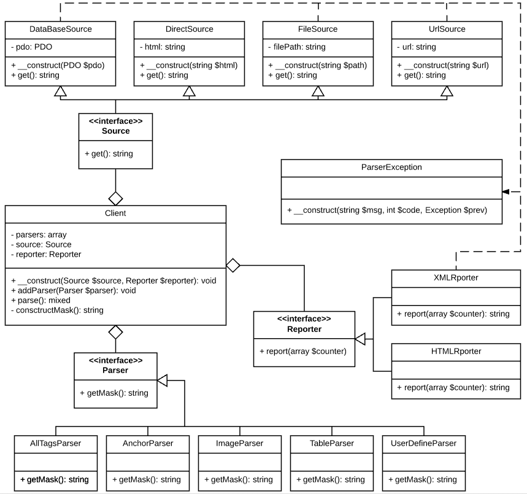

#HTML Parser

Структура:

* index.php - входной скрипт
* source.html - тестовый файл для файлового источника

core:
* class Client - клиент парсера
* class ParserException - исключение парсера

parser:
* abstract class Parser - общий интерфейс для всех парсеров
* class AllTagsParser - парсер с маской для всех возможных тегов
* class AnchorParser - парсер с маской для ссылок
* class ImageParser - парсер с маской для изображений 
* class TableParser - парсер с маской для тегов таблиц
* class UserDefineParser - пользовательский парсер. В конструкторе указывается маска парсера

reporter:
* Reporter - общий интерфейс для всех репортеров
* HTMLReporter - строит отчёт в виде HTML
* XMLReporter - строит отчёт в виде XML и либо выводит его в браузер, либо сохраняет на диск, если в конструктор
передано имя файла
 
source:
* Source - общий интерфейс для всех источников
* DataBaseSource - источник из БД (**не реализован**)
* DirectSource - прямой источник. В конструктор передаётся HTML-код
* FileSource - файловый источник. В конструктор передаётся путь к файлу с HTML-кодом
* UrlSource - URL-источник. В конструктор передаётся URL сайта, который необходимо проанализировать

view:
* result.php - HTML-шаблон для HTML-репортера

